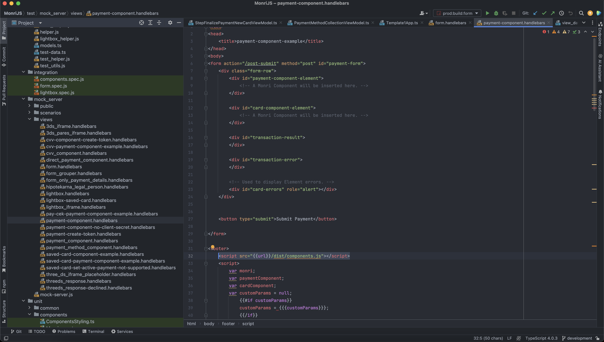

# How 3DS Works?

3D Secure is an additional step you can enable to happen every time a card transaction is made online. It enhances security measures for shoppers and vendors alike.&#x20;

When you turn on 3D Secure, you’ll be asked to validate every transaction with your PIN code. 3D stands for “three domains.” The first is the card issuer; second, the retailer receiving the payment; and third is the 3DS infrastructure platform that acts as a secure go-between for the consumer and the retailer.

When you make a payment for an online purchase, 3DS technology gauges if further safekeeping is needed to make sure that you are the rightful card owner. If so, you’ll be directed to a 3DS page and asked for a password or PIN.&#x20;

Simultaneously, your bank generates a one-off PIN and sends it to your phone via SMS. This is the PIN you’ll need to enter before you can complete the transaction.

<figure><figcaption>
Example 3DS on the test gateway at ipgtest.monri.com
</figcaption></figure>

<figure><figcaption></figcaption></figure>

<figure><figcaption></figcaption></figure>

<figure><figcaption></figcaption></figure>

<figure><figcaption></figcaption></figure>
