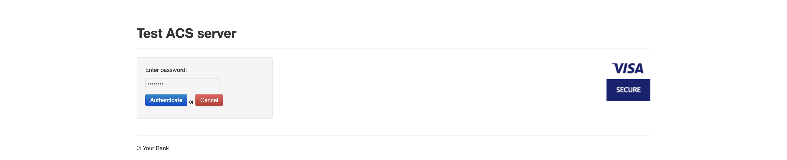

# Redirect Form

<figure><figcaption><p>Line represent just example how trxHash look like</p></figcaption></figure>

<pre class="language-typescript" data-overflow="wrap"><code class="lang-typescript">/**
 * @param {{client_trx_hash: {ch_phone: string, ch_address: string, amount: string, installments_disabled: boolean, ch_full_name: string, ch_country: string, order_number: string, enabled_cards: [string, string, string, string], merchant: *, callbacks: [{name: string}], language: string, possible_acquirers: [{payment_provider_logid: string, id: number}], transaction_type: string, moto: string, ch_city: string, order_info: string, ch_zip: string, test_system: boolean, custom_params: string, trx_token: string, ch_email: string, currency: string}, action: string}} trxHash
 * @param handlebar
 */
function renderFormHandler(trxHash, handlebar = 'form') {
    return function (req, res, options) {
        res.render(handlebar, {
            layout: null,
            trxHash: JSON.stringify(transactionHashOverrides(req, trxHash, options.form_overrides || {}))
        });
    }
}
<strong>
</strong></code></pre>

<pre class="language-typescript"><code class="lang-typescript">// noinspection ES6UnusedImports
import * as Rx from "rx-lite";
import {createNewTransactionApp, createNewTransactionAppData} from "./Template1App";
import {ApplicationData} from "./ApplicationData";
import {createParesTransactionExecutedAppData} from "./paresTransactionExecuted/ParesTransactionExecutedApp";
import {Application, appProxy} from "./common/views/ApplicationView";
import {host, isInIframe} from "../../lightbox/src/utils";
import {Lightbox} from "./lightbox/paresTransactionExecuted/ParesTransactionExecutedApp";
import {createLogger, loggerFactory} from "../../common/logger/Logger";
import {WebPay3Message} from "../../common/logger/WebPay3Message";
import {MonriException, throwMonriException} from "../../common/exceptions/MonriException";
import {loadEnvProperties} from "../../common/environment/Environment";
import {getMonriStatic} from "./MonriStaticImpl";
import {MonriFormWindow} from "./types/MonriFormStatic";


(function (w: any) {

    function appFactory(data: any): Application.App {
        const inIframe = isInIframe();

        const applicationData = data as ApplicationData;
        const action = applicationData.action;

        // noinspection JSUnusedLocalSymbols
        loggerFactory({
            url: host(window.location.href),
            trx_token: applicationData.client_trx_hash.trx_token,
            env: loadEnvProperties(inIframe ? 'lightbox' : 'form')
        });

        const logger = createLogger('form');

        type AppFactory = (data: ApplicationData,
                           document: Document,
                           iframeMode: boolean,
                           paresSubmitted: boolean
        ) => Application.App
        type AppDataFactory = (data: any, iframe: boolean) => ApplicationData

        const appDataMap: { [id: string]: AppDataFactory } = {
            "form/new-transaction": createNewTransactionAppData,
            "form/transaction-sca-retry": createNewTransactionAppData
        };

        const actionAppMap: { [id: string]: AppFactory } = {
            "form/new-transaction": createNewTransactionApp,
            "form/transaction-sca-retry": createNewTransactionApp
        };

        //setting for lightbox integration
        if (inIframe) {
            (window as any).INTEGRATION_TYPE = 'lightbox';
        }

        if (inIframe) {
            appDataMap["pares-submit/trx-executed"] = Lightbox.createParesTransactionExecutedAppData;
            actionAppMap["pares-submit/trx-executed"] = Lightbox.createParesTransactionExecutedApp;
        } else {
            appDataMap["pares-submit/trx-executed"] = createParesTransactionExecutedAppData;
            actionAppMap["pares-submit/trx-executed"] = createNewTransactionApp;
        }

        const appFcn = actionAppMap[action];
        const dataFcn = appDataMap[action];

        if (!appFcn) {
            logger.error(WebPay3Message.formApplicationConfigurationException, {
                action: action
            });
            throwMonriException(MonriException.configurationException);
        } else {
            return appProxy(appFcn(dataFcn(data, inIframe), document, inIframe, "pares-submit/trx-executed" == action));
        }
    }

    // Exposes renderers for change
    <a data-footnote-ref href="#user-content-fn-1">w.MonriFormStatic = getMonriStatic();</a>

    w.createApp = function (data: any) {
        delete w.createApp;
 <a data-footnote-ref href="#user-content-fn-2">       this.monri = appFactory(data)</a>
    };

})(window as unknown as MonriFormWindow);
</code></pre>

<figure><figcaption><p>We need this when drawing the form</p></figcaption></figure>

<figure><figcaption></figcaption></figure>

<figure><figcaption></figcaption></figure>


```typescript
defaultTrxHash: function (options = {}) {
    return {
        "client_trx_hash": {
            ...{
                "possible_acquirers": [
                    {id: 2, payment_provider_logid: 'integration_acq'}
                ],
                "trx_token": "75ab83ad6c21e1b91df2901d02cd0df8f024dba6",
                "language": "en",
                "transaction_type": "purchase",
                "moto": "false",
                "ch_full_name": "John Doe",
                "ch_address": "Street 15",
                "ch_city": "Old Town",
                "ch_zip": "123bnm789",
                "ch_phone": "00-123 456-7",
                "ch_country": "US",
                "ch_email": options.ch_email != null ? options.ch_email : 'email@email.com',
                "order_info": "snowmaster 3000",
                "order_number": "35555c9b31794c5",
                "amount": "100",
                "currency": "EUR",
                "custom_params": JSON.stringify(options.custom_params || {"a": "b"}),
                "installments_disabled": true,
                "merchant": this.defaultMerchant(options['merchant'] || {}),
                "callbacks": [{"name": "DiscountCallback"}],
                "test_system": true,
                "enabled_cards": ["diners", "maestro", "master", "visa"],

            },
            ...options
        }, "action": "form/new-transaction"
    }
},

buildTrxHash: function (options = {}) {
    return this.defaultTrxHash(options);
},
```


The code above I get if we go to /shop at ipgtest.monri.com.

<figure><figcaption><p><a href="https://ipgtest.monri.com/shop">https://ipgtest.monri.com/shop</a></p></figcaption></figure>

<figure><figcaption></figcaption></figure>

The mapping of form.ts to form.js is highlighted, if you see that form.js is included somewhere in the handlebars or something else, you know that one of the .ts files


```typescript
import {links} from "./links";
import {orderInfo, OrderInfoData} from "./order_info";
import {Step1Data} from "./step_order_and_user_details";
import {StepSuccessData} from "./step_success";
import {StepFailureData} from "./step_failure";
import {cardBrandLogos} from "./cardBrandLogos";
import {failureModal} from "./failure_modal";
import {security, SecurityData} from "./security";
import {returnPolicy} from "./return_policy";
import {privacyPolicy, PrivacyPolicyData} from "./privacy_policy";
import {renderTestMode} from "./test_mode";
import {three3dsForm} from "./three_ds_form";
import {stepSelectPayment} from "./step_select_payment";
import {three_ds_iframe} from "./three_ds_iframe";
import {getFormTranslations} from "../../../../translations/Translations";
import {renderCloseButton} from "../../lightbox/paresTransactionExecuted/view/close_button_light_box";
import {AcquirerLogoData, acquirerLogos} from "./acquirersLogos";
import {StepSelectPaymentData, TransactionHash} from "../../TransactionHash";
import {merchantLogo} from "./merchant_logo";
import Optional from "typescript-optional";
import {UICustomization} from "../../../../common/model/UICustomization";
import {stepToc} from "./stepTOC";
import {tocDetails} from "./terms_of_contract";
import {cardBrandSecureLogos} from "./cardBrandSecureLogos";
import {secureCardBrands} from "../../build";
import {Application} from "../views/ApplicationView";
import {TransactionResponse} from "../../../../common/TransactionResponse";

export type BodyData = {
    orderInfo: OrderInfoData,
    acquirers: Array<AcquirerLogoData>
    stepBuyerProfile: Step1Data,
    stepSuccess: StepSuccessData,
    stepFailure: StepFailureData,
    stepSelectPayment: StepSelectPaymentData | null,
    security: SecurityData,
    privacyPolicyData: PrivacyPolicyData,
    iframe: boolean,
    enabledCards: string[],
    renderLightBoxCloseButton: boolean,
    transactionHash: TransactionHash,
    transactionResponse?: TransactionResponse
}

function renderCardBrandsAndAcquirers(data: BodyData) {

    return `<div class="row center-block form-logos text-center">
                ${cardBrandLogos(data.enabledCards, true)}
                ${cardBrandSecureLogos(secureCardBrands(data.enabledCards), true)}
                   ${data.acquirers.length < 2 ? acquirerLogos(data.acquirers, 'one-acq-logo-element') : ''}
            </div>`;
}

function orderInfoColorCss(color: string): string {
    return `#order-info{
            background-color: ${color}!important;
            }`;
}

function orderInfoLabelColorCss(v: string): string {
    return `#order-info-details h4{
                  color: ${v}!important;
                }`;
}

function orderInfoValueColorCss(v: string): string {
    return `#order-info-details p{
                  color: ${v}!important;
                }`;
}

function submitButtonColorCss(v: string): string {
    return `#payment-continue-button, #payment-submit-button, #continue-button  {
                            background-color: ${v};
                    }
            #payment-submit-button:hover, #continue-button:hover, #payment-continue-button.btn-default[disabled]:hover {
                            background-color: ${v};
                            color: #fff;
                    }`
}

function generateStyleForMerchant(data: UICustomization): string {

    return [
        Optional.ofNullable(data.order_info_color).map(orderInfoColorCss).orElse(null),
        Optional.ofNullable(data.order_info_label_color).map(orderInfoLabelColorCss).orElse(null),
        Optional.ofNullable(data.submit_button_color).map(submitButtonColorCss).orElse(null),
        Optional.ofNullable(data.order_info_value_color).map(orderInfoValueColorCss).orElse(null)
    ].filter(e => e != null).join('\n');

}

function bodyTemplate(): (data: BodyData, view: Application.View) => string {
    const translations = getFormTranslations();
    return (data, view) => {

        Optional
            .ofNullable(data.transactionHash.merchant.uiCustomization)
            .ifPresent(uiCustomization => {
                const style: HTMLStyleElement = document.createElement('style');
                style.innerHTML = generateStyleForMerchant(uiCustomization);
                const head: HTMLHeadElement = document.getElementsByTagName('head')[0];
                head.appendChild(style);
            });

        return `
<div class="container">
    
      <div class="row">
        <div class="col-md-12 form-wrapper" id="form-wrapper-view">
    
          <div id="order-info">
            ${links()}
            ${renderCloseButton(data.renderLightBoxCloseButton)}
            ${merchantLogo(data.transactionHash.merchant)}
            ${orderInfo(data.orderInfo)}
            ${data.acquirers.length > 1 ? acquirerLogos(data.acquirers, 'multiple-acq-logo-elements') : ''}
          </div>
          
          <div class="payment-form-wrapper" id="payment-form-wrapper">
    
            <div id="payment-form" class="form-horizontal">
    
              <div class="steps">
                <div class="steps-inner ">
                ${stepToc(data.transactionHash)}
                ${view.renderStepOne(data.stepBuyerProfile).orElse("")}
                ${view.renderStepAcquirerAnimation(data.transactionHash.merchant, data.transactionResponse).orElse("")}
                ${view.renderStepSuccess(data.stepSuccess).orElse("")}
                ${view.renderStepLoading().orElse("")}
                ${view.renderStepFailure(data.stepFailure).orElse("")}
                ${view.renderPaymentStep(data).orElse("")}
                ${data.stepSelectPayment === null ? "" : stepSelectPayment(data.stepSelectPayment)}
                </div>
              </div>
                ${renderCardBrandsAndAcquirers(data)}
            </div>
             
              
            </div>
    
            <div id="static-page-content" style="display: none">
              <span class="close" id="close-page-content">&times;</span>
              <div id="static-page-content-inner"></div>
            </div>
    
          </div>
            ${data.iframe ? three_ds_iframe() : ''}
        </div>
        
      </div>
    
    </div>
    
    ${failureModal(translations)}
    ${security(data.security)}
    ${data.transactionHash.merchant.toc.map(e => tocDetails(e)).orElse('')}
    ${returnPolicy()}
    ${privacyPolicy()}
    ${renderTestMode()}
    ${three3dsForm({acs_url: "", termUrl: "", pareq: "", md: "", iframe: data.iframe})}
    `;
    };
}

export function body(data: BodyData, view: Application.View): string {
    return bodyTemplate()(data, view);
}
```


This code defines a set of functions and data structures for rendering the HTML content of a payment form page, including various UI components and styles. The primary focus is on customizing the payment form's appearance and content based on specific data, such as the merchant's preferences and the current transaction state.

#### Key Components and Functions

1. **Imports and Dependencies**:
   * Various components and functions are imported, such as `links`, `orderInfo`, `stepToc`, and `three3dsForm`. These imports are used to render different parts of the payment form.
2. **`BodyData` Type**:
   * Defines the structure of the data used to render the body of the form. This includes information about the order (`orderInfo`), acquirers (`acquirers`), buyer profile (`stepBuyerProfile`), success and failure steps, security data, privacy policy, whether an iframe is used (`iframe`), enabled card types (`enabledCards`), and other details related to the transaction.
3. **`renderCardBrandsAndAcquirers` Function**:
   * Generates HTML for displaying card brand logos and acquirer logos. It calls `cardBrandLogos` and `cardBrandSecureLogos` to display logos for enabled card brands and secure card brands, respectively. It also conditionally displays acquirer logos based on the number of acquirers.
4. **CSS Helper Functions**:
   * `orderInfoColorCss`, `orderInfoLabelColorCss`, `orderInfoValueColorCss`, `submitButtonColorCss`: These functions generate CSS strings for styling specific elements of the form, such as the order info background, label colors, and button colors.
5. **`generateStyleForMerchant` Function**:
   * Uses the merchant's UI customization data to generate a string of CSS styles. It checks for optional customization data and applies styles accordingly.
6. **`bodyTemplate` Function**:
   * Returns a function that generates the HTML for the entire form body. It takes `data` and `view` as arguments.
   * It includes several key sections:
     * **Styling**: Applies custom styles for the merchant.
     * **Order Info Section**: Displays merchant and order information, including links, logos, and order details.
     * **Payment Form Section**: Renders different steps of the payment process, such as buyer profile, acquirer animation, success, failure, and payment steps.
     * **Static Page Content**: Placeholder for static page content, such as policies.
     * **Security and Policies**: Includes security information, terms of contract details, return policy, and privacy policy.
     * **Test Mode and 3D Secure Form**: Optionally renders test mode information and a 3D Secure form based on the `iframe` property.
7. **`body` Function**:
   * Calls `bodyTemplate()` and applies it with the given `data` and `view` to produce the final HTML for the form.

#### Usage and Context

This code is part of a payment processing system's frontend. It dynamically generates the payment form's HTML based on the provided `BodyData` and merchant-specific customizations. This includes adapting to various payment methods, handling transaction steps (like success, failure, 3D Secure), and ensuring the UI matches the merchant's branding.

The modular approach allows for easy updates and maintenance, as individual components (like logos, buttons, policies) can be modified without affecting the overall structure. The use of localization (through `getFormTranslations`) ensures the form can be displayed in different languages.

<figure><figcaption></figcaption></figure>


```typescript
import {body, BodyData} from "../html/body";
import {animate, clicks, findById, getElementsByClassName} from "../../../../common/view/BaseView";
import Optional from "../../../../common/lib/Optional";
import {ThreeDSForm} from "./ThreeDSForm";
import {FormAppModule} from "../modules/FormAppModule";
import {getFormTranslations} from "../../../../translations/Translations";
import {isInIframe} from "../../../../lightbox/src/utils";
import {WebPay3Message} from "../../../../common/logger/WebPay3Message";
import {RPC} from "../../../../common/rpc/RPC";
import {Logger} from "../../../../common/logger/Logger";
import {RPCMethods} from "../../../../common/rpc/RPCMethods";
import {Step1Data, step1Renderer} from "../html/step_order_and_user_details";
import {paymentStepRenderer} from "../html/payment_step";
import {stepAcquirerAnimation} from "../html/acquirer_animation";
import {stepSuccess, StepSuccessData} from "../html/step_success";
import {stepLoading} from "../html/step_loading";
import {stepFailure, StepFailureData} from "../html/step_failure";
import {getMonriStatic} from "../../MonriStaticImpl";
import App = Application.App;
import {Merchant} from "../../../../common/model/Merchant";
import {TransactionResponse} from "../../../../common/TransactionResponse";

export namespace Application {

    export abstract class App {

        abstract getRPC(): RPC | null

        abstract cancelEnabled(): boolean

        abstract cancelUrl(): string | null

        abstract getLogger(): Logger

        abstract name(): string

        cancelUserOrder() {
            if (isInIframe()) {
                const rpc = this.getRPC();
                if (rpc != null) {
                    rpc.invoke(RPCMethods.LIGHT_BOX_CLOSE);
                }
            } else {
                if (this.cancelEnabled()) {
                    window.location.href = this.cancelUrl();
                } else {
                    this.getLogger().warn(WebPay3Message.cancelOrderCalledWithCancelNotSet)
                }
            }
        }

    }

    export interface View {

        renderApp(data: BodyData, app: App): void

        bindExternalEvents(validationError: Rx.BehaviorSubject<Optional<Error>>): void

        bindEvents(appModule: FormAppModule): void

        renderStepOne(data: Step1Data): Optional<string>

        renderPaymentStep(data: BodyData): Optional<string>

        renderStepAcquirerAnimation(merchant: Merchant, transactionResponse: TransactionResponse | null): Optional<string>

        renderStepSuccess(data: StepSuccessData): Optional<string>

        renderStepLoading(): Optional<string>

        renderStepFailure(data: StepFailureData): Optional<string>
    }
}

class ApplicationViewImpl implements Application.View {
    threeDsView: ThreeDSForm;

    constructor(readonly document: Document
    ) {

    }

    renderApp(data: BodyData, app: App): void {
        this.document.body.innerHTML = body(data, this);
        // TODO: make test that will query all views and check if views exist
        this.threeDsView = new ThreeDSForm(this.document.getElementById("three-3ds-form") as HTMLFormElement);
        clicks(findById("step-failure-cancel-button"), e => {
            app.cancelUserOrder()
        });
    }

    bindEvents(appModule: FormAppModule): void {
        this.threeDsView.bindEvents(appModule);

        const threedsiframe = document.getElementById("three-ds-iframe") as HTMLIFrameElement;

        if (threedsiframe != null) {
            threedsiframe.onload = () => {
                const translations = getFormTranslations();
                const e = document.getElementById('threeds-iframe-content-preview-p');
                if (e) {
                    e.textContent = translations.form.three_ds_please_wait;
                }
            }
        }
    }

    bindExternalEvents(validationError: Rx.BehaviorSubject<Optional<Error>>): void {
        const iframe_links = getElementsByClassName('iframe_content_btn');
        const staticPageContent = findById('static-page-content');
        const staticPageContentInner = findById('static-page-content-inner');
        const paymentFormWrapper = findById("payment-form-wrapper");

        for (let i = 0; i < iframe_links.length; i++) {
            const el = iframe_links[i];
            clicks(el, function (e) {
                e.preventDefault();
                staticPageContent.style.display = 'block';
                staticPageContentInner.innerHTML = findById(this.getAttribute('data-div-id')).innerHTML;
                if (screen.width <= 768) {
                    animate(document.scrollingElement || document.documentElement, "scrollTop", "", 100, paymentFormWrapper.offsetTop, 500, true);
                }
            });
        }

        findById('close-page-content').addEventListener('click', function () {
            findById('static-page-content').style.display = 'none';
        });
    }

    renderStepOne(data: Step1Data): Optional<string> {
        return Optional.ofNullable(
            Optional
                .ofNullable(getMonriStatic().renderer().stepOne)
                .orElse(step1Renderer)({data: data, defaultRenderer: step1Renderer})
                .html
        );
    }

    renderStepAcquirerAnimation(merchant: Merchant, transactionResponse: TransactionResponse | null): Optional<string> {
        return Optional.ofNonNull(stepAcquirerAnimation(merchant, transactionResponse));
    }

    renderStepSuccess(data: StepSuccessData): Optional<string> {
        return Optional.ofNonNull(stepSuccess(data));
    }

    renderStepLoading(): Optional<string> {
        return Optional.ofNonNull(stepLoading());
    }

    renderStepFailure(data: StepFailureData): Optional<string> {
        return Optional.ofNonNull(stepFailure(data));
    }

    renderPaymentStep(data: BodyData): Optional<string> {
        return Optional.ofNullable(
            Optional
                .ofNullable(getMonriStatic().renderer().stepPayment)
                .orElse(paymentStepRenderer)({data: data, defaultRenderer: paymentStepRenderer})
                .html
        );
    }
}

export function createApplicationView(document: any): Application.View {
    return new ApplicationViewImpl(document);
}

export function appProxy(app: Application.App): Application.App {
    return {
        cancelEnabled(): boolean {
            return app.cancelEnabled();
        },
        cancelUrl(): string | null {
            return app.cancelUrl();
        },
        cancelUserOrder(): void {
            return app.cancelUserOrder();
        },
        getLogger(): Logger {
            return app.getLogger();
        },
        getRPC(): RPC | null {
            return app.getRPC();
        },
        name(): string {
            return app.name()
        }
    }
}


// monri.rendererFactory().

```


This code provides the structure and implementation of an application for handling a payment process in a web environment. It includes an `Application` namespace with abstract classes and interfaces defining the structure of the application and its views. It also includes a concrete implementation of the `Application.View` interface, called `ApplicationViewImpl`, which manages rendering different parts of the payment form and binding necessary events.

#### Key Components and Functions

**1. Application Namespace**

* **App Class**:
  * An abstract class defining the structure of an application. It includes several abstract methods and properties:
    * `getRPC()`: Returns an instance of `RPC` (Remote Procedure Call) for communicating with other systems.
    * `cancelEnabled()`: Determines whether the cancel action is enabled.
    * `cancelUrl()`: Returns the URL to redirect to when an order is canceled.
    * `getLogger()`: Returns a logger instance for logging events and errors.
    * `name()`: Returns the name of the application.
  * **`cancelUserOrder()` Method**:
    * Cancels the user's order. If the application is running in an iframe, it uses RPC to invoke a method for closing the lightbox. Otherwise, it either redirects to the cancel URL or logs a warning if cancellation is not set.
* **View Interface**:
  * An interface defining methods that a view implementation must have. It includes:
    * `renderApp(data: BodyData, app: App)`: Renders the main application view.
    * `bindExternalEvents(validationError: Rx.BehaviorSubject<Optional<Error>>): void`: Binds events related to external elements or actions.
    * `bindEvents(appModule: FormAppModule): void`: Binds events related to the application module.
    * Methods for rendering specific steps or parts of the form (e.g., `renderStepOne`, `renderPaymentStep`, `renderStepAcquirerAnimation`, `renderStepSuccess`, `renderStepLoading`, `renderStepFailure`).

**2. ApplicationViewImpl Class**

This class implements the `Application.View` interface and provides concrete implementations for rendering and managing the payment form's UI.

* **Constructor**:
  * Initializes the class with a `Document` object and sets up the `threeDsView` (for handling 3D Secure form interactions).
* **`renderApp(data: BodyData, app: App)` Method**:
  * Sets the inner HTML of the document's body to the rendered form content by calling the `body` function with `data` and the current view instance (`this`).
  * Initializes `threeDsView` with the 3D Secure form element from the document.
  * Binds a click event to the cancel button (if present), which triggers the `cancelUserOrder` method from the `app` instance.
* **`bindEvents(appModule: FormAppModule)` Method**:
  * Binds events for handling 3D Secure interactions using the `threeDsView` object.
  * Sets up an event listener for when the 3D Secure iframe loads, displaying a message to the user.
* **`bindExternalEvents(validationError: Rx.BehaviorSubject<Optional<Error>>)` Method**:
  * Binds click events to elements with the class `iframe_content_btn` to display static page content in a popup.
  * Also binds a click event to close the static page content popup.
* **Methods for Rendering Steps**:
  * `renderStepOne(data: Step1Data)`: Renders the first step of the form (e.g., order and user details).
  * `renderPaymentStep(data: BodyData)`: Renders the payment step.
  * `renderStepAcquirerAnimation(merchant: Merchant, transactionResponse: TransactionResponse | null)`: Renders an animation for acquirer processing.
  * `renderStepSuccess(data: StepSuccessData)`: Renders the success step.
  * `renderStepLoading()`: Renders a loading indicator.
  * `renderStepFailure(data: StepFailureData)`: Renders the failure step.

**3. Utility Functions**

* **`createApplicationView(document: any)` Function**:
  * Factory function to create an instance of `ApplicationViewImpl` using the provided `document`.
* **`appProxy(app: Application.App)` Function**:
  * Creates a proxy for an `Application.App` instance, forwarding method calls to the original instance. This can be useful for ensuring controlled access or adding additional logic.

#### Context and Usage

This code is part of a web-based payment processing system. It defines the structure and functionality needed to render and manage the user interface for the payment process, including handling different transaction states (e.g., loading, success, failure) and interactions like canceling an order or displaying 3D Secure forms. The use of TypeScript interfaces and classes helps ensure type safety and clear separation of concerns, making the codebase easier to maintain and extend.


<figure><figcaption></figcaption></figure>



```typescript
import {paymentSubmitButton} from "./payment-submit-button";
import {BodyData} from "./body";
import {getFormTranslations} from "../../../../translations/Translations";
import {pick_payment_method_button} from "./pick_payment_method_button";
import {inputError} from "./input_error";
import {installmentSelection} from "./installment_selection";
import {cvvInput} from "./cvv_input";
import {tokenizeCard} from "./tokenize_card";
import {FormRenderContext, FormRenderResult} from "../../types/FormRenderers";


export function paymentStepRenderer(context: FormRenderContext<BodyData>): FormRenderResult {
    return {html: paymentStep(context.data)}
}

function paymentStep(data: BodyData): string {

    const trxHash = data.transactionHash;
    const inputErrorView = inputError();
    const width = (trxHash.installmentsEnabled || trxHash.number_of_installments) ? 8 : 12;

    function emailFormGroup(data: BodyData, cardType: string): string {
        if (data.transactionHash.renderEmail) {
            const isEmailReadonly = trxHash.isFieldReadonly('ch_email')
            return renderEmail(data.transactionHash.ch_email, cardType, isEmailReadonly);
        } else {
            const isFullNameReadonly = trxHash.isFieldReadonly('ch_full_name')
            return renderFullName(data.transactionHash.ch_full_name, cardType, isFullNameReadonly);
        }
    }

    function renderEmail(email: string, cardType: string, isFieldReadonly = false): string {
        return `
         <div class="form-group" id="${cardType}_card_transaction_email_group">
            <label for="${cardType}_card_transaction_ch_email">${translations.transaction.email}</label>
            <input ${isFieldReadonly ? 'readonly disabled' : ''} type="email" class="form-control" id="${cardType}_card_transaction_ch_email" placeholder="${translations.transaction.email}"
                   value="${email}">
            ${inputErrorView}
        </div>`;
    }

    function renderFullName(chFullName: string = data.transactionHash.ch_full_name, cardType: string, isFieldReadonly = false): string {
        return `
          <div class="form-group" id="${cardType}_card_transaction_full_name_group">
            <label for="${cardType}_card_transaction_ch_full_name">${translations.transaction.full_name}</label>
            <input ${isFieldReadonly ? 'readonly disabled' : ''} type="text" class="form-control" id="${cardType}_card_transaction_ch_full_name" placeholder="${translations.transaction.full_name}"
                   value="${chFullName}">
            ${inputErrorView}
          </div>`
    }

    function newCardExpiry(data: BodyData): string {
        return `
          <div class="col-xs-6 no-padding expiry-wrapper" id="new_card_transaction_expiry_group">
    <div class="form-group ">
      <label for="new_card_transaction_expiry">${translations.transaction.expiration_date}</label>
${inputErrorView}
      <input id="new_card_transaction_expiry" class="form-control cc-exp" type="tel" placeholder="MM / GG" value="">
    </div>
  </div>`
    }

    function savedCardCvv(data: BodyData): string {
        return `${cvvInput({moto: data.transactionHash.moto, saved_card_payment: true})}`;
    }

    function newCardCvv(data: BodyData): string {
        return `${cvvInput({moto: data.transactionHash.moto, saved_card_payment: false})}`;
    }

    function savedCardCardExpiry(data: BodyData): string {

        return `
            <div class="col-xs-6 no-padding expiry-wrapper" id="new_card_transaction_expiry_group">
    <div class="form-group ">
      <label for="saved_card_transaction_expiry">${translations.transaction.expiration_date}</label>
      <input id="saved_card_transaction_expiry" class="form-control cc-exp" type="tel" disabled placeholder="MM / GG" value="" required="">
    </div>
  </div>`
    }

    function savedCardPanFormGroup(data: BodyData): string {
        return `<div class="col-xs-${width} no-padding" id="saved_card_transaction_credit_card_section">
    <div class="form-group" id="creditCard-wrapper">
        <label for="saved_card_transaction_masked_pan">${translations.transaction.card_number} </label>
        <input type="tel" class="form-control cc-num" id="saved_card_transaction_masked_pan" disabled
    value="">
        </div>
        </div>`
    }

    function newCardPanFormGroup(data: BodyData): string {
        return `    <div class="no-padding col-xs-${width} credit-card-wrapper" id="new_card_transaction_credit_card_section">
        <div class="form-group">
            <label for="new_card_transaction_pan">${translations.transaction.card_number} </label>
            <input type="tel" class="form-control cc-num" id="new_card_transaction_pan" placeholder="">
            ${inputErrorView}
        </div>
    </div>`
    }

    function newCardInstallmentSelectionGroup(data: BodyData): string {
        return installmentSelection(data.transactionHash, 'new_card_transaction');

    }

    function savedCardInstallmentSelectionGroup(data: BodyData): string {
        return installmentSelection(data.transactionHash, 'saved_card_transaction');

    }

    function renderNewCardTransactionForm(data: BodyData): string {
        if (!data.transactionHash.isNewCardPayment()) {
            return '';
        }
        return `<div id="new_card_transaction_form">
        ${(emailFormGroup(data, 'new'))}
        ${(newCardPanFormGroup(data))}
        ${(newCardInstallmentSelectionGroup(data))}
        ${(newCardExpiry(data))}
        ${(newCardCvv(data))}
        ${trxHash.rememberCardEnabled() ? tokenizeCard() : ''}
    </div>`;
    }

    function renderSavedCardTransactionForm(data: BodyData): string {
        if (!data.transactionHash.isSavedCardPayment()) {
            return '';
        }
        return `<div id="saved_card_transaction_form">
        ${(emailFormGroup(data, 'saved'))}
        ${(savedCardPanFormGroup(data))}
        ${(savedCardInstallmentSelectionGroup(data))}
        ${(savedCardCardExpiry(data))}
        ${(savedCardCvv(data))}
    </div>`;
    }

    const translations = getFormTranslations();

    return `<div id="step-payment" style="display: none">
    <a href="JavaScript:void(0)" id="payment-return-button">&larr; <span>${translations.form.profile}</span></a>
    ${trxHash.multiplePaymentMethods() ? pick_payment_method_button(translations.form.pick_payment_method) : ''}

    ${renderNewCardTransactionForm(data)}
    ${renderSavedCardTransactionForm(data)}

    ${paymentSubmitButton(trxHash.cancelEnabled())}
    <p id="discounts-message"></p>
</div>`;

}

```


1. **`paymentStepRenderer` Function**:
   * **Input**: Takes a `FormRenderContext<BodyData>` as an argument, which contains context and data necessary for rendering the form.
   * **Output**: Returns a `FormRenderResult` object with an `html` property that contains the generated HTML string from the `paymentStep` function.
2. **`paymentStep` Function**:
   * **Input**: Accepts a `BodyData` object containing details about the transaction.
   * **Output**: Returns a string of HTML for the payment step form.

#### **Helper Functions**

Several helper functions are defined within `paymentStep` to modularize the rendering of different parts of the form:

1. **`emailFormGroup` Function**:
   * Renders either an email input or a full name input based on the `renderEmail` property of the `transactionHash`.
   * Uses `isFieldReadonly` to determine if the field should be read-only.
2. **`renderEmail` Function**:
   * Generates HTML for an email input field, including error handling.
3. **`renderFullName` Function**:
   * Generates HTML for a full name input field, including error handling.
4. **`newCardExpiry` Function**:
   * Renders the input field for the card's expiration date for a new card transaction.
5. **`savedCardCvv` and `newCardCvv` Functions**:
   * Render the CVV input fields for saved and new card transactions, respectively. They use the `cvvInput` component with different configurations.
6. **`savedCardCardExpiry` Function**:
   * Renders the expiration date field for saved cards, which is disabled as it is not editable.
7. **`savedCardPanFormGroup` and `newCardPanFormGroup` Functions**:
   * Render the input field for the card number (PAN) for saved and new card transactions.
8. **`newCardInstallmentSelectionGroup` and `savedCardInstallmentSelectionGroup` Functions**:
   * Render the installment selection component, which allows the user to choose an installment plan if available.
9. **`renderNewCardTransactionForm` and `renderSavedCardTransactionForm` Functions**:
   * Assemble the different parts of the form for new and saved card transactions, respectively, based on the `transactionHash` data.

#### **Main Rendering Logic**

* The `paymentStep` function collects the necessary HTML snippets generated by the helper functions and combines them into a complete form.
* It includes a return button, a method to pick a payment method if multiple are available, and a submit button. It also considers whether to display email, full name, installment selection, and card details based on the type of payment (new or saved card) and transaction settings.
* **Conditional Rendering**: The form is constructed based on conditions such as whether installments are enabled, whether the transaction involves a new or saved card, and whether to remember card details for future transactions.

#### **Additional Components and Imports**

* **`paymentSubmitButton`**: Presumably a function or component that returns the HTML for the payment submit button.
* **`pick_payment_method_button`**: Likely a component that allows users to select a payment method if more than one is available.
* **`inputError`**: A component for displaying input errors.
* **`installmentSelection`**: Component to render installment options.
* **`cvvInput`**: Component for CVV input.
* **`tokenizeCard`**: Likely a component for handling card tokenization.

#### **Usage Context**

This code is used to dynamically generate and display the payment form based on the user's transaction context, ensuring that all relevant information is presented and correctly formatted. It handles both new and saved card scenarios, including email or full name capture, CVV input, and any additional features like installment plans.


```typescript
import {getFormTranslations} from "../../../../translations/Translations";
import {cancelButton} from "./cancel_button";

const translations = getFormTranslations();

export function paymentSubmitButton(cancelEnabled: boolean): string {
    return `<button id="payment-submit-button" type="submit" class="btn btn-default btn-block default-btn fe-left text-uppercase">
    <span class="payment-text">${translations.form.pay}</span>
    <span class="payment-in-progress">${translations.form.payment_in_progress}</span>
    <span class="payment-successful">${translations.form.payment_successful}</span>
    <span class="payment-failed">${translations.transaction.payment_failed}</span>
  </button>${cancelEnabled ? cancelButton('payment-submit-cancel-button') : ''}`
}
```


This code defines a function `paymentSubmitButton` that generates and returns an HTML string for a payment submission button. The button is styled and includes several states (default, in-progress, successful, failed), and optionally includes a cancel button based on the provided parameter.

#### **Key Components and Their Roles**

1. **`getFormTranslations` Function**:
   * Imported from `Translations`. This function fetches localized strings for the form, which are used to display text in the user's language or locale.
2. **`translations` Constant**:
   * Stores the result of `getFormTranslations()`, providing access to various translated strings used in the form.
3. **`cancelButton` Function**:
   * Imported from `./cancel_button`. It likely generates an HTML string for a cancel button, accepting an ID as an argument.

#### **`paymentSubmitButton` Function**

**Parameters**

* **`cancelEnabled: boolean`**: A boolean indicating whether the cancel button should be included alongside the submit button.

**Function Logic and Output**

* The function returns an HTML string that contains:
  * **Submit Button**:
    * **`<button>`** element with an ID of `payment-submit-button` and a `type` of `submit`. It uses several classes for styling and formatting.
    * **`<span class="payment-text">`**: Displays the default text for the payment button, fetched from `translations.form.pay`.
    * **`<span class="payment-in-progress">`**: Displays a message while the payment is in progress, fetched from `translations.form.payment_in_progress`.
    * **`<span class="payment-successful">`**: Displays a message when the payment is successful, fetched from `translations.form.payment_successful`.
    * **`<span class="payment-failed">`**: Displays a message when the payment has failed, fetched from `translations.transaction.payment_failed`.
  * **Cancel Button**:
    * The function includes a call to `cancelButton('payment-submit-cancel-button')` if the `cancelEnabled` parameter is `true`. This function likely returns HTML for a cancel button, which is given the ID `payment-submit-cancel-button`.

**Usage Context**

* This function is used to render the payment submission button on a payment form. The button dynamically reflects different states of the payment process (e.g., in progress, success, failure). The optional cancel button provides the user with an option to cancel the payment if `cancelEnabled` is `true`. This setup is likely part of a larger form submission and payment handling logic in a web application, ensuring that the user interface adapts to various stages of the payment process.

<figure><figcaption></figcaption></figure>

This TypeScript code defines a class called `OrderDetailsStepView` that extends a base class `PaymentFormStep`. This class is responsible for managing the UI and interactions for a step in a payment form where users enter order details, such as cardholder name, postal code, phone number, address, and other relevant information. It also includes functionality for handling legal entities and different input fields, binding events, and managing the view's lifecycle.

#### Key Components and Functionality

**1. Imports**

The imports bring in various components and utilities needed for the form, including input fields (like `PostalCodeInput`, `TelephoneInput`), utility functions (`findById`, `clicks`), and other dependencies (`OrderDetailsStepViewModel`, `SubmitButton`, `Button`, `Optional`, `Rx`, `InputValue`).

**2. Class Definition: `OrderDetailsStepView`**

* **Properties**:
  * `cardHolderName`: An instance of `CardHolderNameInput`, representing the cardholder's name input field.
  * `postalCode`, `phone`, `address`, `country`, `company`, `city`, `idNumber`, `iban`: Instances of respective input classes, representing various details the user can enter. These fields are initialized conditionally based on the availability of corresponding HTML elements.
  * `stepsWrapper`: A reference to the wrapper element containing the steps.
  * `viewModel`: An instance of `OrderDetailsStepViewModel` that manages the state and data of the form step.
  * `cancelButton`: A reference to the cancel button element.
  * `legalEntityCheckBox`: A checkbox for toggling the legal entity mode.
  * `continueToPaymentScreen`: A button instance to proceed to the next step.
* **Constructor**:
  * Initializes the properties by finding the corresponding HTML elements and creating instances of input classes.
  * Calls `bindEvents()` to attach event listeners and data bindings.
* **`bindEvents` Method**:
  * Sets up event listeners and data bindings between the view and the `viewModel`.
  * Uses an array of `Optional` objects to manage the presence of inputs.
  * Binds the legal entity checkbox change event to update the `viewModel`.
  * Manages the visibility of legal entity-specific fields and labels.
  * Subscribes to various observables to update the UI based on changes in the `viewModel`.
  * Binds the continue button click to trigger the `continueToPaymentScreen` action in the `viewModel`.
  * Sets up cancel button functionality if available.
* **`afterRemove` Method**:
  * Overrides the `afterRemove` method from `PaymentFormStep` to clean up the `viewModel` and input fields when the view is removed.
* **`id` Method**:
  * Returns a unique identifier for the view, used for identifying the step.

#### Usage and Context

The `OrderDetailsStepView` class is used in a payment form to handle user interactions and data entry for the order details step. It ensures that the user can enter all necessary information, validates the input, and communicates changes to the `viewModel`. This class also handles specific scenarios, like enabling legal entity-specific fields when the corresponding checkbox is selected.

The implementation uses the `Optional` utility to handle nullability gracefully and the `Rx` library to manage reactive data flows, ensuring that the UI updates in response to changes in the model. The class follows a component-based approach, encapsulating functionality and data within specific components (input fields, buttons) and managing their interactions through event bindings and data subscriptions.

_Now we will move on to the part that explains how the values ​​from the order and user\_details steps are rendered._

#### Constants and Types

* `translations`: Stores the translations for various form fields, fetched using `getFormTranslations()`.

**Type Definitions**

* **`Step1DataTransaction`**: Describes the shape of the transaction data collected in step 1, including fields like `ch_full_name`, `ch_address`, `ch_email`, etc.
* **`TranslateTransaction`**: Defines translation keys for transaction-related text, such as labels for form fields.
* **`Step1Data`**: Represents the data structure for rendering step 1, including transaction details, translation texts, view states, and transaction hash.

#### Functions

**`renderHolder`**

This function returns another function that generates HTML for a form group containing a label and an input field. It uses `data` to populate the field's value and label, and `id` and `translateKey` to identify the specific field and its corresponding translation.

**`renderFullName`**

Returns a function that renders the full name field, with the label changing based on whether the user is a legal person or not (`responsible_person` vs. `full_name`).

**Other `render...Holder` Functions**

These functions (`renderAddressHolder`, `renderZipHolder`, `renderCityHolder`, `renderCountryHolder`, `renderPhoneHolder`, `renderIban`, `renderIdNumber`, `renderCompanyName`) follow a similar pattern to `renderFullName`. They each render specific fields for the form using `renderHolder`.

**`renderSwitchLegalEntity`**

Renders a checkbox for switching to legal entity mode if the transaction is for a legal person.

**`render`**

A main rendering function that generates HTML for all the form fields in step 1. It differentiates the fields displayed based on whether the transaction involves a legal person or not.

**`template1Fcn`**

A function that generates the full template for the first step of the form, including form fields, the continue button, and a conditional cancel button.

#### Exported Functions

**`step1Renderer`**

Accepts a `FormRenderContext` with `Step1Data` and returns a `FormRenderResult` containing the rendered HTML.

**`step1`**

A shorthand function that calls `template1Fcn()` with the provided data and returns the resulting HTML.

**`stepBuyerProfileFromTrxHash`**

Takes a `TransactionHash` object and returns a `Step1Data` object populated with the necessary transaction, translation, and view data.

#### Summary

The code is designed to dynamically render the first step of a payment form, handling various fields and conditions based on whether the user is an individual or a legal person. It supports multiple translations and includes error handling, read-only state management, and conditional rendering based on the data provided.


<figure><figcaption><p>Pick Payment Method Screen</p></figcaption></figure>

```typescript
import {step_select_payment_item} from "./step_select_payment_item";
import {SavedCard} from "../../../../common/SavedCard";
import {StepSelectPaymentData} from "../../TransactionHash";
import {PaymentMethodType} from "../../../../common/PaymentDetails";
import {NEW_CARD_PAYMENT_METHOD_ID} from "../../../../common/common";
import {getFormTranslations} from "../../../../translations/Translations";
import {imageUrl} from "../../build";
import {step_select_payment_item_pay_cek} from "./step_select_payment_item_pay_cek";
import {PayCekPaymentMethod} from "../../../../common/PayCekPaymentMethod";

declare const IS_DEVELOPMENT: boolean

const translations = getFormTranslations();

function step_select_new_card(): string {
    return `<li id="${NEW_CARD_PAYMENT_METHOD_ID}"  
class="payment-selection-item list-group-item"
>

<p class="payment-selection-item-new-card">${translations.form.pay_with_new_card}</p>
</li>`;
}

export function stepSelectPayment(data: StepSelectPaymentData): string {
    return `<div id="step-select_payment" style="display: none;">
  <a href="JavaScript:void(0)" id="payment-finalize-return-button" style="width: 100%;">← <span>${data.translate.form.card_payment}</span></a>
  
  <p class="pick-payment-method-title">${data.translate.form.pick_payment_method_title}</p>
  <ul class="payment-selection list-group">
  ${data.methods.map(pm => {
        if (pm.type === PaymentMethodType.card) {
            return step_select_new_card()
        } else if (pm.type === PaymentMethodType.saved_card) {
            return step_select_payment_item(pm.data as SavedCard)
        } else if (pm.type === PaymentMethodType.direct_payment) {
            return step_select_payment_item_pay_cek(pm.data as PayCekPaymentMethod)
        } else {
            if (IS_DEVELOPMENT) {
                throw new Error(`stepSelectPayment invoked with unsupported type = ${pm.type}`)
            }
            return ''
        }
    }).join("")}
</ul>
</div>`;
}
```

This code defines a function `stepSelectPayment` that generates HTML for a payment method selection interface, allowing users to choose how they want to pay for a transaction. It handles different types of payment methods, including new cards, saved cards, and direct payment methods. The function uses various utility functions and constants, and it includes error handling for unsupported payment methods during development.

#### Key Components and Functions

**1. Imports and Declarations**

* **Imported Modules and Types**:
  * `step_select_payment_item`: A function that returns HTML for displaying a saved card option.
  * `SavedCard`: A type representing saved card details.
  * `StepSelectPaymentData`: A type representing data for selecting a payment method.
  * `PaymentMethodType`: An enum or type defining different types of payment methods.
  * `NEW_CARD_PAYMENT_METHOD_ID`: A constant identifier for the "new card" payment method.
  * `getFormTranslations`: A function that returns translation strings for the form.
  * `imageUrl`: A function that generates URLs for images.
  * `step_select_payment_item_pay_cek`: A function that returns HTML for displaying a direct payment method option (specifically for PayCek).
  * `PayCekPaymentMethod`: A type representing PayCek payment method details.
* **`IS_DEVELOPMENT`**: A constant indicating whether the code is running in a development environment. This is used to conditionally throw errors for unsupported payment types.
* **`translations`**: A constant storing translation strings, retrieved using `getFormTranslations()`.

**2. `step_select_new_card` Function**

This function returns HTML for a new card payment option:


```javascript
function step_select_new_card(): string {
    return `<li id="${NEW_CARD_PAYMENT_METHOD_ID}" class="payment-selection-item list-group-item">

<p class="payment-selection-item-new-card">${translations.form.pay_with_new_card}</p>
</li>`;
}
```


* **HTML Structure**:
  * `li`: A list item representing a new card option. It has an ID set to `NEW_CARD_PAYMENT_METHOD_ID` and includes:
    * An image (`img`) for the credit card logo, sourced from `imageUrl`.
    * A paragraph (`p`) with the translated text "Pay with new card."

**3. `stepSelectPayment` Function**

This function generates HTML for displaying a list of available payment methods:


```javascript
export function stepSelectPayment(data: StepSelectPaymentData): string {
    return `<div id="step-select_payment" style="display: none;">
  <a href="JavaScript:void(0)" id="payment-finalize-return-button" style="width: 100%;">← <span>${data.translate.form.card_payment}</span></a>
  
  <p class="pick-payment-method-title">${data.translate.form.pick_payment_method_title}</p>
  <ul class="payment-selection list-group">
  ${data.methods.map(pm => {
        if (pm.type === PaymentMethodType.card) {
            return step_select_new_card()
        } else if (pm.type === PaymentMethodType.saved_card) {
            return step_select_payment_item(pm.data as SavedCard)
        } else if (pm.type === PaymentMethodType.direct_payment) {
            return step_select_payment_item_pay_cek(pm.data as PayCekPaymentMethod)
        } else {
            if (IS_DEVELOPMENT) {
                throw new Error(`stepSelectPayment invoked with unsupported type = ${pm.type}`)
            }
            return ''
        }
    }).join("")}
</ul>
</div>`;
}
```


* **HTML Structure**:
  * `div`: A container for the payment method selection UI, initially hidden with `style="display: none;"`.
  * `a`: A link styled as a button for returning to the previous step, with text indicating card payment.
  * `p`: A paragraph with the title "Pick a payment method" in the appropriate language.
  * `ul`: An unordered list of payment methods.
* **Mapping Through Payment Methods**:
  * The function iterates over `data.methods`, which contains the available payment methods, and returns the corresponding HTML for each method:
    * **New Card**: Uses `step_select_new_card` to return the new card option HTML.
    * **Saved Card**: Uses `step_select_payment_item` to return the HTML for a saved card, casting `pm.data` to `SavedCard`.
    * **Direct Payment**: Uses `step_select_payment_item_pay_cek` to return the HTML for a direct payment method, casting `pm.data` to `PayCekPaymentMethod`.
    * **Unsupported Types**: If an unsupported payment method type is encountered, an error is thrown if `IS_DEVELOPMENT` is true; otherwise, an empty string is returned.

#### Usage and Context

This code is designed for a web application that handles payment processing, offering users multiple payment options. The `stepSelectPayment` function dynamically generates the appropriate HTML for the available payment methods based on the data provided. The modular approach, with separate functions for different payment methods, makes it easy to maintain and extend the code, such as adding new payment types or customizing the UI for each method. The use of `IS_DEVELOPMENT` ensures that issues are caught early during development by throwing errors for unsupported payment types.

[^1]: We need this when drawing the form

[^2]: With this, you have registered the field on the window object that createApp is a function with one parameter, and it does not return anything.. Each tab has this window object of type any, until you delete that file with delete, just in case, there will be no more of them
